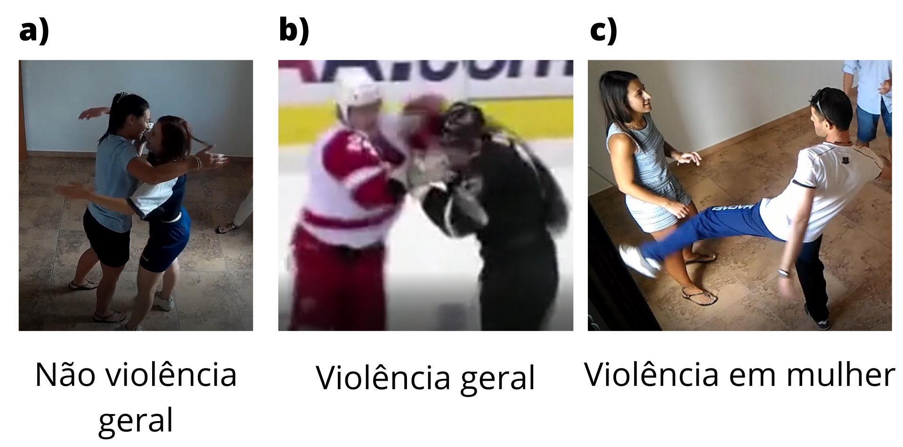

# dataset-violence-and-non-violence
Dataset que contém 690 vídeos, separados em três classes:
* 230 vídeos de violência geral 
* 230 vídeos não violência geral 
* 230 vídeos violência contra mulher

# Detalhes
Imagem ilustrativa dos vídeos da base de dados

* Vídeos em formato .mp4
* Duração de 1 a 5 segundos

# Repositórios de Referência
[A Dataset for Automatic Violence Detection in Videos](https://github.com/airtlab/A-Dataset-for-Automatic-Violence-Detection-in-Videos)

[Brigas de Hockey](http://visilab.etsii.uclm.es/personas/oscar/FightDetection/HockeyFights.zip)
